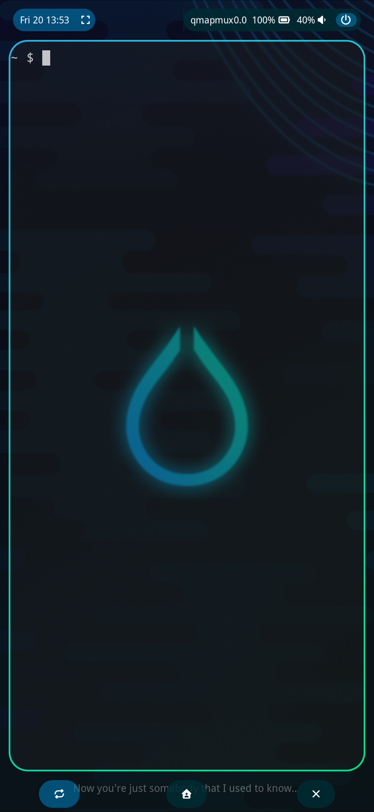
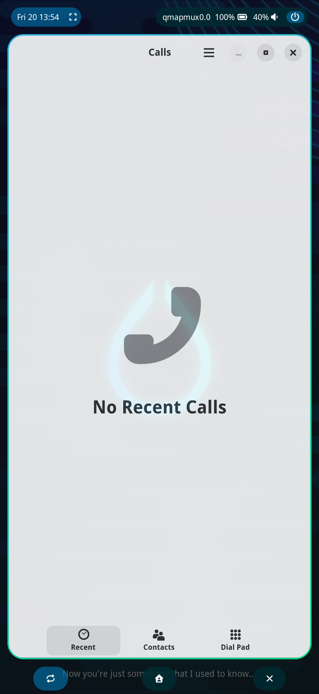

# hyprland-on-pmos
Build Hyprland on PostmarketOs from git source. The version packaged in pmos is fairly old and doesn't support some of the new features shipped with newer versions. For instance you can now interact with a layer in the lockscreen by setting the [layer rule](https://wiki.hypr.land/Configuring/Window-Rules/) `above_lock` to 2; this allows you to use any screen locker that supports the `ext-session-lock protocol`, like [hyprlock](https://github.com/hyprwm/hyprlock.git), and unlock your device using an OSK (effectively a layer in hyprland), like [wvkbd](https://github.com/jjsullivan5196/wvkbd.git).

## Showcase

   

## Installation

~~First of all your pmOS device *must* use openrc as a service manager (systemd conflicts with some libraries eg. libinput).~~
The following installation was tested on:
- OnePlus 6T (fajita)

### Install the dependecies

- for Hyprland:
```sh
doas apk add git build-base cmake meson pixman-dev cairo-dev pango-dev libjpeg-turbo-dev libwebp-dev librsvg-dev file-dev udis86-git-dev mesa-egl mesa-gles mesa-dev pugixml-dev libinput-dev wayland-dev wayland-protocols-dev libdisplay-info-dev hwdata-dev libzip-dev tomlplusplus-dev bison libxcursor-dev re2-dev muparser-dev xcb-util-wm-dev xcb-util-errors-dev cpio libxcomposite-dev xcb-util-keysyms xcb-util-keysyms-dev libliftoff cpio hyprland-protocols docker iniparser-dev glslang-dev spirv-tools-dev
```
- for the rest of my installation (utilities & config):
```sh
sudo apk add slurp grim wl-clipboard glm-dev gtkmm4-dev gtk4-layer-shell-dev alacritty waybar hypridle swaybg jq hyprlock dunst neovim scdoc font-awesome-free brightnessctl
```

### Run the scripts

- To install Hyprland:
```sh
cd hyprland-on-pmos
doas chmod +x install.sh
cd ..
doas hyprland-on-pmos/hyprinstaller.sh
```
- To install utilities and apply my config: 
```sh
doas chmod +x install_config.sh
cd ..
doas hyprland-on-pmos/install_config.sh
# copy config files + make the scripts executable + add symlink for switch.sh
cp -rf hyprland-on-pmos/dots/* .config/
sudo chown -R $USER .config/hypr/scripts/
sudo chmod +x .config/hypr/scripts/*.sh
sudo chmod +x .config/waybar/scripts/*.sh
ln -sf .config/hypr/scripts/volume.conf .config/hypr/scripts/active.conf
# allow $USER to use brightnessctl w/o root privileges
su $USER
doas usermod -aG video $USER
exit
```
- To update:
```sh
cd hyprland-on-pmos
doas chmod +x hyprupdater.sh
cd ..
doas hyprland-on-pmos/update.sh
```

## Additional notes

Some dependencies might not be required anymore.

## Cool project used in this setup

Other than of course [Hyprland](hypr.land) and [PostmarketOs](postmarketos.org), the list contains (in no particular order):
- sys64
- wvkbd
- waybar
- lisgd
- hyprshot
- alacritty
